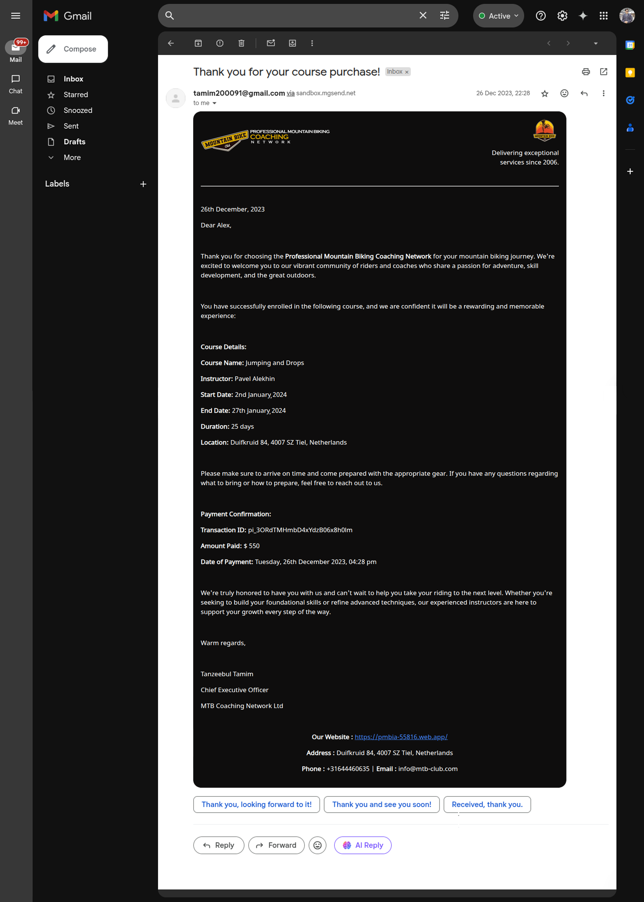

<h1 style="display: flex; align-items: center;">
    
    <span>MTB-Coaching - Server End</span>
</h1>

Welcome to the server-side repository of the **_Professional Mountain Biking Coaching Network_** website. It is responsible for handling API requests and managing the database functionalities.

<br>

## 📚 Table of Contents

-   [Features](#-features)
-   [Packages & Technologies Used](#-packages--technologies-used)
-   [Project Structure](#-project-structure)
-   [Prerequisites](#-prerequisites)
-   [Installation, Configuration & Running Locally](#-installation-configuration--running-locally)
-   [API Endpoints](#-api-endpoints)
-   [Testing the API](#-testing-the-api)
-   [Email System](#-email-system)
-   [Checkout the Client End](#-checkout-the-client-end)
-   [Live Deployment](#-live-deployment)
-   [Uptime Monitoring](#-uptime-monitoring)
-   [Contributing](#-contributing)
-   [License](#-license)

<br>

## 🚀 Features

-   CRUD operations for users and items.
-   Database interactions using MongoDb.
-   Environment-based configuration.
-   Search and sort functionality for instructors and courses
-   Transactional emails using Nodemailer with Mailgun integration.
-   Date and time formatting with Moment.js.
-   Handlebars – for generating dynamic HTML email template rendering

<br>

## 🧰 Packages & Technologies Used

- **Node.js**: JavaScript runtime environment for building scalable server-side applications
- **Express.js**: Web framework for Node.js to handle routing and middleware
- **MongoDB**: NoSQL database for storing application data
- **JSON Web Token (JWT)**: For authentication and secure API access
- **Moment.js**: For date and time formatting
- **Nodemailer**: For sending transactional emails
- **Mailgun Transport**: For email delivery via Mailgun API
- **Handlebars**: For generating dynamic HTML email templates
- **UptimeRobot**: For monitoring server uptime and alerting when the API is down
- **Render**: For cloud deployment and hosting of the server-side API

<br>

## 📁 Project Structure

```
MTB-Coaching-Server/
├── public/                         # Static assets (images, logos, etc.)
├── src/
│   ├── routes/                     # API route handlers-related operations
│   │   ├── bookings.js             # Booking and payment-related API endpoints (class booking, payment intent, etc.)
│   │   ├── classes.js              # Class-related API endpoints (list, search, top classes, etc.)
│   │   ├── instructors.js          # Instructor-related API endpoints (list, search, top instructors, etc.)
│   │   └── users.js                # User-related API endpoints (create/update user, get user by email, etc.)
│   ├── app.js                      # Express app configuration and middleware setup
│   ├── email.service.js            # Email sending logic and configuration
│   └── server.js                   # Server startup and environment configuration
├── templates/
│   └── paymentConfirmation.html    # HTML template for payment confirmation emails
├── .env.example                    # Template Environment variables for local development
├── .gitignore                      # Specifies files and folders to be ignored by Git
├── LICENSE                         # Project license information (MIT)
├── package-lock.json               # Auto-generated lockfile for npm dependencies
├── package.json                    # Project metadata and dependencies
└── README.md                       # Project documentation (this file)
```

<br>

## ✅ Prerequisites

- [**Node.js**](https://nodejs.org/) (v18 or higher recommended)
- [**npm**](https://www.npmjs.com/) (comes with Node.js)
- [**MongoDB**](https://www.mongodb.com/try/download/community) (running locally or accessible remotely)
- A [`.env`](./.env.example) file with required environment variables  
  _(See the detailed guide in the [Installation, Configuration & Running Locally](#-installation-configuration--running-locally) section below)_

<br>

## 🔧 Installation, Configuration & Running Locally

1. **_Clone the repository:_**

    ```bash
    git clone https://github.com/Tanzeebul-Tamim/MTB-Coaching-Server
    cd MTB-Coaching-Server
    ```

2. **_Install dependencies:_**

    ```bash
    npm install
    ```

3. **_Set up Environment Variables:_**

    - **Rename the [`.env.example`](./.env.example) file in the project root to `.env`:**

        This file contains the following fields:

        ```env
        PORT=5000
        DB_USER=yourDatabaseUser
        DB_PASS=yourSecureDbPassword
        PAYMENT_SECRET_KEY=sk_test_YourPaymentSecretKeyHere
        EMAIL_PRIVATE_KEY=yourEmailPrivateKey
        EMAIL_DOMAIN=mg.yourdomain.com
        MAIL_SENDER=verified_sender@example.com
        ```

    - **Guide & Configuration Details**

        - **`PORT` (Server Port):**
            
            The port your server will listen on (commonly `5000` or `8000`).
            <br>

        - **`DB_USER` (Database Username):**

            Username credential for your database (used in connection string or DB config).
            <br>

        - **`DB_PASS` (Database Password):**

            Corresponding password for the `DB_USER`.
            <br>

        - **`PAYMENT_SECRET_KEY` (Payment Gateway Secret Key):**

            Your [**_Stripe_**](https://stripe.com/) payment processor’s private/secret key .
            <br>

        - **`EMAIL_PRIVATE_KEY` (Email Private Key):**

            The private key from your [**_Nodemailer_**](https://www.npmjs.com/package/nodemailer) email service provider.
            <br>

        - **`EMAIL_DOMAIN` (Email Domain):**

            Domain or subdomain configured for sending emails.
            <br>

        - **`MAIL_SENDER` (Sender Email Address):**

            The verified sender address used by your mailer - [**_Nodemailer_**](https://www.npmjs.com/package/nodemailer) to send emails from the application.
            This email must be authorized in your email service configuration.

            > ***📌 Note:*** <br>
            > In development, you can use a test email. In production, make sure this is a verified and authenticated sender (especially for services like Mailgun, SendGrid, etc.).

        > ⚠️ **Caution:** <br>
        > Never commit your `.env` file to version control (GitHub, Git, etc.) as it contains sensitive credentials. Always keep this file private and add `.env` to your [`.gitignore`](./.gitignore).

4. **_Running the application_:**

    Start the server:

    ```bash
    npm start
    ```

<br>

## 📡 API Endpoints

<details open>
<summary>
    <span style="font-size:1.05em; font-weight:bold;">
        Click to expand for a full list of available API endpoints and usage examples
    </span>
</summary>

<br>

Easily integrate with the _MTB Coaching Network_ backend using these RESTful API endpoints.

> **❕ NB:** <br>
> Several endpoints require query or request body parameters for correct operation. If you do not provide the required parameters, you may receive empty results or errors.

-   **Users**

    -   **_PUT_** `/users/:email`:

        Save or update a user in the database. Expects user data in the request body.

        **Required Request Body Parameters:**

        - ***`name` (string):*** Full name of the user.
        - ***`role` (string):*** User's role in the system, such as `student` or `instructor`

        > **Example**: <br>
        > _PUT_ `/users/john@example.com` <br>

        > **Body**: <br>
        > `{ "name": "John Doe", "role": "Student" }`

    -   **_GET_** `/users/:email`:

        Get a specific user by email.

        > **Example**: <br>
        > _GET_ `/users/john@example.com`

     <br>

-   **Instructors**

    -   **_GET_** `/instructors?count=<number>&search=<string>`:

        Get a list of all instructors.  
        ***Optional query parameters:***

        - ***`count` (number):*** Limits the number of instructors returned. If omitted, returns all.
        - ***`search` (string):*** Case-insensitive search by instructor name. If omitted, returns all.

        <br>

        > **Example**: <br>
        > _GET_ `/instructors?count=5&search=Alex`

    -   **_GET_** `/instructors/total`:

        Get the total number of instructor accounts registered.    

    -   **_GET_** `/instructors/top`:

        Get the top 6 instructors (by total students) and a list of all instructors with their total students.

    -   **_GET_** `/instructor/total/:id`:

        Get the number of total students of a specific instructor.

        > **Example**: <br>
        > _GET_ `/instructor/total/6653e1b2c1a2b3d4e5f6a7b8`
        
    -   **_GET_** `/instructor/students/:id/:idx`:

        Get the student list of a specific course of a specific instructor (`idx` represents course-index).

        > **Example**: <br>
        > _GET_ `/instructor/students/6653e1b2c1a2b3d4e5f6a7b8/0`

    -   **_GET_** `/instructor/:id`:

        Get a single instructor by MongoDB ObjectId.

        > **Example**: <br>
        > _GET_ `/instructor/6653e1b2c1a2b3d4e5f6a7b8`

    -   **_PUT_** `/instructor/updateStudentCount`:

        Update an instructor's class student count.

        **Required Request Body Parameters:**

        - ***`instructorId` (string):*** The unique identifier of the instructor.
        - ***`classIndex` (number):*** The index of the class to update.

        > **Example**: <br>
        > _PUT_ `/instructor/updateStudentCount`
        
        > **Body**: <br>
        > `{ "instructorId": "6653e1b2c1a2b3d4e5f6a7b8", "classIndex": 0 }`

        <br>

-   **Classes**

    -   **_GET_** `/classes/total`:

        Get the total number of classes.

    -   **_GET_** `/classes/top`:

        Get the top 6 classes (by total students).

    -   **_GET_** `/classes?count=<number>&search=<string>`:

        Get all classes.
        
        **Query parameters:**

        - ***`count` (number):*** Limits the number of classes returned. If omitted, returns empty array.
        - ***`search` (string):*** Case-insensitive search, filters by class name. If omitted, returns all.

        <br>

        > **📌 Note:** <br>
        > _`count`_ is required & `search` is optional.
        
        > **Examples**: <br>
        > _GET_ `/classes?count=10` <br>
        > _GET_ `/classes?count=5&search=Beginner`

    <br>

-   **Bookings**

    -   **_PUT_** `/book-class`:

        Post a booking. Expects booking details in the request body.

        **Required Request Body Parameters:**

        - ***`studentId` (string):*** The unique identifier of the student.
        - ***`instructorId` (string):*** The unique identifier of the instructor.
        - ***`studentEmail` (string):*** Email address of the student.
        - ***`studentName` (string):*** Name of the student.
        - ***`classIndex` (number):*** The index of the class to update.
        - ***`paymentStatus` (string):*** ndicates whether the student has completed payment (`paid` or `unpaid`).
        - ***`transactionId` (string):*** The unique Stripe transaction ID associated with the payment.
        - ***`date` (string):*** Timestamp of the payment, stored as an ISO date string in MongoDB.

        > **Example**: <br>
        > _PUT_ `/book-class`

        > **Body**: <br>
        >```
        >    {
        >       "classIndex": 1,
        >       "instructorId": "664fd275e708c848f468d0cd",
        >       "studentId": "8b1bba74f6764dd8a92a1111",
        >       "date": "2023-06-02T01:50:00.000Z",
        >       "paymentStatus": "paid",
        >       "studentEmail": "kunderwood@yahoo.com",
        >       "studentName": "James Aguilar",
        >       "transactionId": "pi_Nc9zs7Xqr6LXS9W7aCgRr4Uz"
        >    }
        >```

    -   **_GET_** `/book-class/:studentId`:

        Get all bookings for a user by their studentId.

        > **Example**: <br>
        > _GET_ `/book-class/6653e1b2c1a2b3d4e5f6a7b8`

    -   **_GET_** `/book-class/:loggedId/:studentId/:itemId`:

        Get a specific booking by studentId and booking itemId.

        > **⚠️ Security Note:** <br>
        > The `loggedId` parameter represents the currently logged-in user's ID. The server compares `loggedId` with `studentId` to ensure that users can only access their own bookings. If the IDs do not match, access is denied. This mechanism prevents users from viewing or manipulating bookings that do not belong to them, enforcing user-level access control.

        > **Example**: <br>
        > _GET_ `/book-class/6653e1b2c1a2b3d4e5f6a7b8/6653e1b2c1a2b3d4e5f6a7b8/6653e1b2c1a2b3d4e5f6a7c0`

    -   **_DELETE_** `/book-class/:studentId`:

        Delete a specific booking by studentId and itemId.
            
        **Required Request Body Parameters:**

        - ***`instructorId` (string):*** The unique identifier of the instructor.
        - ***`classIndex` (number):*** The index of the class to update.

        > **Example**: <br>
        > _DELETE_ `/book-class/6653e1b2c1a2b3d4e5f6a7b8`

        > **Body**: <br>
        > `{ "instructorId": "6653e1b2c1a2b3d4e5f6a7b8", "classIndex": 0 }`

    -   **_DELETE_** `/booking/:studentId`:

        Delete all unpaid bookings for a user by studentId.

        > **Example**: <br>
        > _DELETE_ `/booking/6653e1b2c1a2b3d4e5f6a7b8`

    -   **_POST_** `/create-payment-intent`:

        Create a Stripe payment intent. Expects `{ price }` in the request body.

        **Required Request Body Parameters:**

        - ***`price` (number):*** The amount to be charged for the payment intent.

        > **Example**: <br>
        > _POST_ `/create-payment-intent`

        > **Body**: <br>
        `{ "price": 99.99 }`

</details>

<br>

### 🧪 **Testing the API**

-   Use tools like [***Postman***](https://www.postman.com/), [***Insomnia***](https://insomnia.rest/), or your browser (for GET requests) to test endpoints.
-   For endpoints requiring query parameters (like `/classes`), always include them in the URL.
-   For `POST`/`PUT` endpoints, provide the required _JSON body_.
-   The server will respond with JSON data for all endpoints.

> **❕ NB:** <br>
> For more details on _request/response_ formats, see the source code in [**`src/routes/`**](./src/routes/).

<br>

## 📨 Email System

This server uses ***Nodemailer*** with ***Mailgun*** and ***Handlebars*** templating to send transactional emails, such as:

-   Enrollment confirmations
-   Payment receipts

> ⚠️ **Note on Email Testing:** <br>
> Due to the use of a **Mailgun sandbox domain** (part of the free-tier setup), emails can **only be sent to pre-authorized recipients**. This means only specified test addresses (e.g., mine) will successfully receive emails. Other users will not receive them unless added as authorized recipients.

To evaluate the email system:

-   Please refer to the screenshot below showing the rendered email content.
-   The email [**_logic_**](./src/email.service.js), [**_structure_**](./templates/paymentConfirmation.html), and [**_template integration_**](./src/routes/bookings.js#L55-L63) can be reviewed in the source code.

<br>

<p align="center">
    
</p>    

<br>

## 💻 Checkout the Client End

Visit the [**_front-end repository_**](https://github.com/Tanzeebul-Tamim/MTB-Coaching-Client) of the website.

<br>

## 🌐 Live Deployment

The API is deployed at [**Render**](https://render.com/) and can be accessed through [**_this following URL_**](https://mtb-coaching-server.onrender.com/).

> **⚠️ Important Note on Free Hosting _(Render)_:** <br>
>   This backend is hosted on _Render_’s free plan. The server will “spin down” (go to sleep) after periods of inactivity, which can cause the first request after a while to take up to 50 seconds or more to respond. Subsequent requests will be fast. This is normal behavior for free-tier hosting and does not indicate a problem with the API. <br>


## 🟢 Uptime Monitoring

The server’s uptime is monitored by [**UptimeRobot**](https://uptimerobot.com/). View real-time status [**_here_**](https://stats.uptimerobot.com/XiArWT3Wic).

>   **⚠️ Note one Uptime Monitoring _(UptimeRobot)_:** <br>
>   Uptime is now monitored continuously using _UptimeRobot_, so if the server ever “spins down” (goes down) unexpectedly, we’ll know right away. <br>


<br>

## 🤝 Contributing

Have ideas to improve this API? Found a bug?
Let’s make it better together! [Open an issue](https://github.com/Tanzeebul-Tamim/MTB-Coaching-Server/issues) or submit a pull request.

<br>

## 📄 License

This project is licensed under the **MIT License** - see the [**_LICENSE_**](LICENSE) file for details.
