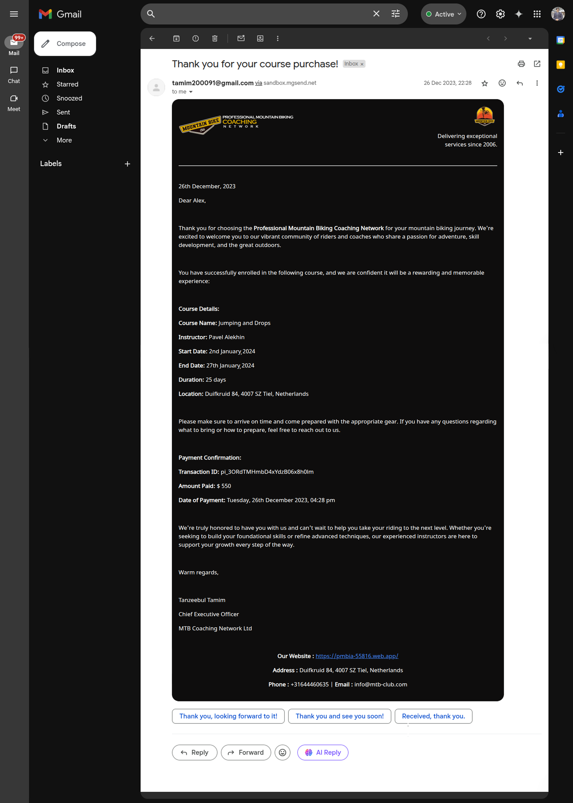

<h1 style="display: flex; align-items: center;">
    
    <span>MTB-Coaching - Server Side</span>
</h1>

Welcome to the server-side repository of the **_Professional Mountain Biking Coaching Network_** website. It is responsible for handling API requests and managing the database functionalities.

## Table of Contents

-   [Features](#-features)
-   [Technologies Used](#-technologies-used)
-   [Prerequisites](#-prerequisites)
-   [Project Structure](#-project-structure)
-   [Installation, Configuration & Running Locally](#-installation-configuration-and-running-locally)
-   [API Endpoints](#-api-endpoints)
-   [Email System](#-email-system)
-   [Checkout the Client End](#-checkout-the-client-end)
-   [Live Deployment](#-live-deployment)
-   [License](#-license)

## 🚀 Features

-   CRUD operations for users and items.
-   Database interactions using MongoDb.
-   Environment-based configuration.
-   Search and sort functionality for instructors and courses
-   Transactional emails using Nodemailer with Mailgun integration.
-   Date and time formatting with Moment.js.
-   Handlebars – for generating dynamic HTML email template rendering

## 🧰 Technologies Used

-   Node.js
-   Express.js
-   MongoDB
-   JSON Web Token (JWT)
-   Moment.js – for date and time formatting
-   Nodemailer – for sending transactional emails
-   Mailgun Transport – for email delivery via Mailgun API
-   Handlebars – for generating dynamic HTML email templates

## ✅ Prerequisites

-   Node.js and npm installed.
-   MongoDB installed and running.

## 📁 Project Structure

```
MTB-Coaching-Server/
├── .gitignore          # Lists files for Git to ignore
├── index.js            # Main entry point of the application
├── LICENSE
├── README.md           # Project documentation
├── package.lock.json   # Exact dependency tree
├── package.json        # Project metadata and dependencies
└── vercel.json         # Vercel deployment settings
```

## 🔧 Installation, Configuration and Running Locally

1. **_Clone the repository:_**

    ```bash
    git clone https://github.com/Tanzeebul-Tamim/MTB-Coaching-Server
    cd MTB-Coaching-Server
    ```

2. **_Install dependencies:_**

    ```bash
    npm install
    ```

3. **_Set up Environment Variables:_**

    Create a `.env` file in the project root & add the following fields:

    ```env
    PORT
    DB_USER
    DB_PASS
    PAYMENT_SECRET_KEY
    EMAIL_PRIVATE_KEY
    EMAIL_DOMAIN
    MAIL_SENDER
    ```

    **Guide & Configuration Details**

    - **SERVER PORT:**

        The port your server will listen on (commonly 5000 or 8000)
        **`PORT=5000`**
        <br>

    - **DATABASE USERNAME:**

        Username credential for your database (used in connection string or DB config)
        **`DB_USER=yourDatabaseUser`**
        <br>

    - **DATABASE PASSWORD:**

        Corresponding password for the `DB_USER`
        **`DB_PASS=yourSecureDbPassword`**
        <br>

    - **PAYMENT GATEWAY SECRET KEY:**

        Your _Stripe_ payment processor’s private/secret key
        **`PAYMENT_SECRET_KEY=sk_test_YourPaymentSecretKeyHere`**
        <br>

    - **EMAIL PRIVATE KEY:**

        The private key from _Nodemailer_ email service provider
        **`EMAIL_PRIVATE_KEY=yourEmailPrivateKeyValue`**
        <br>

    - **EMAIL DOMAIN:**

        Domain or subdomain configured for sending emails
        **`EMAIL_DOMAIN=mg.yourdomain.com`**
        <br>

    - **SENDER EMAIL ADDRESS:**

        The verified sender address used by your mailer - _Nodemailer_ to send emails from the application.
        This email must be authorized in your email service configuration.

        **`MAIL_SENDER=your_verified_sender@example.com`**

        > 📌 In development, you can use a test email. In production, make sure this is a verified and authenticated sender (especially for services like Mailgun, SendGrid, etc.).

4. **_Running the application_**
    - Start the server:
        ```bash
        npm start
        ```

## 📡 API Endpoints

-   **Users**

    -   **_PUT_** `users/:email`: Save user in db
    -   **_GET_** `users/:email`: Get a single user by email
        <br>

-   **Instructors**

    -   **_GET_** `/instructors`: Get all instructors
    -   **_GET_** `/instructors/total`: Get how many instructor accounts have been registered
    -   **_GET_** `/instructors/top`: Get top 6 instructors & the number of their total students
    -   **_GET_** `/instructors/:id`: Get a single instructor by ID
    -   **_PUT_** `/instructor/updateStudentCount`: Update instructors available seat
        <br>

-   **Classes**

    -   **_GET_** `/classes`: Get all classes
    -   **_GET_** `/classes/total`: Get the total number of classes
    -   **_GET_** `/classes/top`: Get top 6 classes
        <br>

-   **Bookings**

    -   **_PUT_** `/book-class`: Post a booking
    -   **_GET_** `/book-class/:studentId`: Get user bookings
    -   **_GET_** `/book-class/:studentId/:itemId`: Get a booking
    -   **_DELETE_** `/book-class/:studentId/:itemId`: Delete a booking
    -   **_DELETE_** `/booking/:studentId`: Delete all bookings of a user
        <br>

-   **Payment**
    -   **_POST_** `/create-payment-intent`: Create payment intent
        <br>

## 📨 Email System

This server uses **Nodemailer** with **Mailgun** and **Handlebars** templating to send transactional emails, such as:

-   Enrollment confirmations
-   Payment receipts

Below is a screenshot of the transaction confirmation email sent to the clients:



## 💻 Checkout the Client End

Visit the [**_front-end repository_**](https://github.com/Tanzeebul-Tamim/MTB-Coaching-Client) of the website.

## 🌐 Live Deployment

The API is deployed at vercel and can be accessed through [**_this following URL_**](https://summer-camp-school-server-ivory.vercel.app/)

## 📄 License

This project is licensed under the **MIT License** - see the [**_LICENSE_**](LICENSE) file for details.
