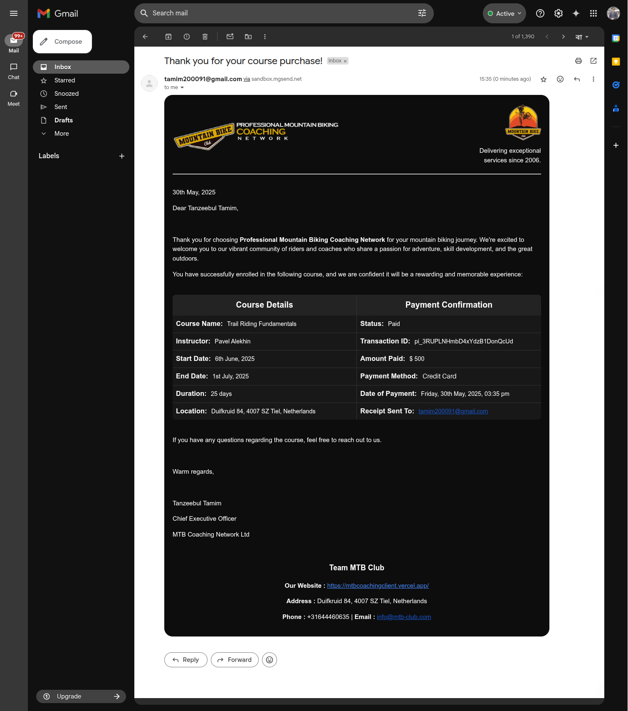

<h1 style="display: flex; align-items: center;">
    
    <span>MTB-Coaching - Server End</span>
</h1>

Welcome to the server-side repository of the **_Professional Mountain Biking Coaching Network_** website. This backend powers the API, database, authentication, transactional emails, and all server-side logic for the platform.

<br>

## 📚 Table of Contents

-   [🚀 Features](#-features)
-   [🧰 Packages & Technologies Used](#-packages--technologies-used)
-   [📁 Project Structure](#-project-structure)
-   [✅ Prerequisites](#-prerequisites)
-   [🔧 Installation, Configuration & Running Locally](#-installation-configuration--running-locally)
-   [📡 API Endpoints](#-api-endpoints)
-   [🧪 Testing the API](#-testing-the-api)
-   [📨 Email System](#-email-system)
-   [🔄 Demo Data Freshness](#-demo-data-freshness)
-   [💻 Checkout the Client End](#-checkout-the-client-end)
-   [🌐 Live Deployment](#-live-deployment)
-   [🟢 Uptime Monitoring](#-uptime-monitoring)
-   [🤝 Contributing](#-contributing)
-   [📄 License](#-license)

<br>

## 🚀 Features

-   **_RESTful CRUD_** operations for users, instructors, classes, and bookings
-   **_MongoDB database_** integration for persistent data storage
-   **_Environment-based configuration_** for secure deployment
-   **_Search_**, **_filter_**, and **_sort_** for instructors and courses
-   Transactional emails (enrollment, payment receipts) via **_Nodemailer_** & **_Mailgun_**
-   Date and time formatting with **_Moment.js_**
-   **_Handlebars_** for dynamic HTML email templates
-   Automated and manual endpoints for demo data freshness (see below)

<br>

## 🧰 Packages & Technologies Used

<div style="display: flex; gap: 10px; flex-wrap: wrap;">  
  <a href="https://nodejs.org/" target="_blank" rel="noopener noreferrer">
    
  </a>

  <a href="https://expressjs.com/" target="_blank" rel="noopener noreferrer">
    
  </a>

  <a href="https://www.mongodb.com/" target="_blank" rel="noopener noreferrer">
    
  </a>

  <a href="https://momentjs.com/" target="_blank" rel="noopener noreferrer">
    
  </a>

  <a href="https://nodemailer.com/" target="_blank" rel="noopener noreferrer">
    
  </a>

  <a href="https://www.mailgun.com/" target="_blank" rel="noopener noreferrer">
    
  </a>

  <a href="https://handlebarsjs.com/" target="_blank" rel="noopener noreferrer">
    
  </a>

  <a href="https://render.com/" target="_blank" rel="noopener noreferrer">
    
  </a>

  <a href="https://uptimerobot.com/" target="_blank" rel="noopener noreferrer">
    
  </a>
</div>

<br>

<details>
   <summary>
      <strong>
         Full list of <i>Packages & Technologies Used</i> (Click to expand)
      </strong>
   </summary>

#### **Core Framework & Server**

-   **Node.js**: JavaScript runtime for building scalable server-side applications
-   **Express.js**: Fast and minimalist web framework for Node.js

#### **Database & Data Handling**

-   **MongoDB**: NoSQL database used for storing application data
-   **Moment.js**: Utility for formatting and manipulating dates

#### **Email & Communication**

-   **Nodemailer**: Library for sending emails from the server
-   **Mailgun**: Email API service used as a transport for Nodemailer
-   **Handlebars**: Templating engine for formatting dynamic HTML email bodies

#### **Deployment & Monitoring**

-   **Render**: Cloud platform for deploying and hosting the backend server
-   **UptimeRobot**: Monitoring tool to ensure the backend is always up and running

</details>

<br>

## 📁 Project Structure

```
MTB-Coaching-Server/
├── public/                         # Static assets (images, logos, etc.)
├── src/
│   ├── routes/                     # API route handlers
│   │   ├── bookings.js             # Booking and payment-related endpoints
│   │   ├── classes.js              # Class-related endpoints
│   │   ├── instructors.js          # Instructor-related endpoints
│   │   └── users.js                # User-related endpoints
│   ├── app.js                      # Express app configuration
│   ├── email.service.js            # Email sending logic
│   └── server.js                   # Server startup and environment config
├── scripts/
│   └── updateClassDate.js          # Script to randomize instructor class dates for demo freshness
├── templates/
│   └── paymentConfirmation.html    # HTML template for payment confirmation emails
├── .env.example                    # Example environment variables
├── .gitignore                      # Git ignored files
├── LICENSE                         # MIT license
├── package-lock.json               # NPM lockfile
├── package.json                    # Project metadata and dependencies
└── README.md                       # Project documentation (this file)
```

<br>

## ✅ Prerequisites

-   [**Node.js**](https://nodejs.org/) (v18 or higher recommended)
-   [**npm**](https://www.npmjs.com/) (comes with Node.js)
-   [**MongoDB**](https://www.mongodb.com/) (Atlas or local instance)
-   A [`.env`](./.env.example) file with required environment variables

<br>

## 🔧 Installation, Configuration & Running Locally

1. **Clone the repository:**

    ```bash
    git clone https://github.com/Tanzeebul-Tamim/MTB-Coaching-Server
    cd MTB-Coaching-Server
    ```

2. **Install dependencies:**

    ```bash
    npm install
    ```

3. **Set up Environment Variables:**

    - **Rename the [`.env.example`](./.env.example) file in the project root to `.env` and fill in your credentials:**

        ```env
        PORT=5000
        DB_USER=yourDatabaseUser
        DB_PASS=yourSecureDbPassword
        PAYMENT_SECRET_KEY=sk_test_YourPaymentSecretKeyHere
        EMAIL_PRIVATE_KEY=yourEmailPrivateKey
        EMAIL_DOMAIN=mg.yourdomain.com
        MAIL_SENDER=verified_sender@example.com
        ADMIN_SECRET=your_admin_secret_here
        ```

    - <details>
        <summary><strong>Guide & Configuration Details (Click to expand)</strong></summary>

        - **`PORT` (Server Port):**

            The port your server will listen on (commonly `5000` or `8000`).
            <br>

        - **`DB_USER` (Database Username):**

            Username credential for your database (used in connection string or DB config).
            <br>

        - **`DB_PASS` (Database Password):**

            Corresponding password for the `DB_USER`.
            <br>

        - **`PAYMENT_SECRET_KEY` (Payment Gateway Secret Key):**

            Your [**_Stripe_**](https://stripe.com/) payment processor’s private/secret key .
            <br>

        - **`EMAIL_PRIVATE_KEY` (Email Private Key):**

            The private key from your [**_Nodemailer_**](https://www.npmjs.com/package/nodemailer) email service provider.
            <br>

        - **`EMAIL_DOMAIN` (Email Domain):**

            Domain or subdomain configured for sending emails.
            <br>

        - **`MAIL_SENDER` (Sender Email Address):**

            The verified sender address used by your mailer - [**_Nodemailer_**](https://www.npmjs.com/package/nodemailer) to send emails from the application.
            This email must be authorized in your email service configuration.

            > **_📌 Note:_** In development, you can use a test email. In production, make sure this is a verified and authenticated sender (especially for services like Mailgun, SendGrid, etc.).

    </details>

    <br>

    > ⚠️ **Caution:** <br>
    > Never commit your `.env` file to version control (GitHub, Git, etc.) as it contains sensitive credentials. Always keep this file private and add `.env` to your [`.gitignore`](./.gitignore).

4. **Start the server:**

    ```bash
    npm start
    ```

<br>

## 📡 API Endpoints

Easily integrate with the **_MTB Coaching Network_ backend** using these RESTful API endpoints.

> **❕ NB:** <br>
> Several endpoints require query or request body parameters for correct operation. If you do not provide the required parameters, you may receive empty results or errors.

<details>
<summary>
    <strong>
        Click to expand for a full list of available API endpoints and usage examples
    </strong>
</summary>

-   **Users**

    -   **_PUT_** `/users/:email`:

        Save or update a user in the database. Expects user data in the request body.

        **Required Request Body Parameters:**

        - ***`name` (string):*** Full name of the user.
        - ***`role` (string):*** User's role in the system, such as `student` or `instructor`

        > **Example**: <br>
        > _PUT_ `/users/john@example.com` <br>

        > **Body**: <br>
        > `{ "name": "John Doe", "role": "Student" }`

    -   **_GET_** `/users/:email`:

        Get a specific user by email.

        > **Example**: <br>
        > _GET_ `/users/john@example.com`

     <br>

-   **Instructors**

    -   **_GET_** `/instructors?count=<number>&search=<string>`:

        Get a list of all instructors.  
        ***Optional query parameters:***

        - ***`count` (number):*** Limits the number of instructors returned. If omitted, returns all.
        - ***`search` (string):*** Case-insensitive search by instructor name. If omitted, returns all.

        <br>

        > **Example**: <br>
        > _GET_ `/instructors?count=5&search=Alex`

    -   **_GET_** `/instructors/total`:

        Get the total number of instructor accounts registered.    

    -   **_GET_** `/instructors/top`:

        Get the top 6 instructors (by total students) and a list of all instructors with their total students.

    -   **_GET_** `/instructor/total/:id`:

        Get the number of total students of a specific instructor.

        > **Example**: <br>
        > _GET_ `/instructor/total/6653e1b2c1a2b3d4e5f6a7b8`
        
    -   **_GET_** `/instructor/students/:id/:idx`:

        Get the student list of a specific course of a specific instructor (`idx` represents course-index).

        > **Example**: <br>
        > _GET_ `/instructor/students/6653e1b2c1a2b3d4e5f6a7b8/0`

    -   **_GET_** `/instructor/:id`:

        Get a single instructor by MongoDB ObjectId.

        > **Example**: <br>
        > _GET_ `/instructor/6653e1b2c1a2b3d4e5f6a7b8`

    -   **_PUT_** `/instructor/updateStudentCount`:

        Update an instructor's class student count.

        **Required Request Body Parameters:**

        - ***`instructorId` (string):*** The unique identifier of the instructor.
        - ***`classIndex` (number):*** The index of the class to update.

        > **Example**: <br>
        > _PUT_ `/instructor/updateStudentCount`
        
        > **Body**: <br>
        > `{ "instructorId": "6653e1b2c1a2b3d4e5f6a7b8", "classIndex": 0 }`

        <br>

-   **Classes**

    -   **_GET_** `/classes/total`:

        Get the total number of classes.

    -   **_GET_** `/classes/top`:

        Get the top 6 classes (by total students).

    -   **_GET_** `/classes?count=<number>&search=<string>`:

        Get all classes.
        
        **Query parameters:**

        - ***`count` (number):*** Limits the number of classes returned. If omitted, returns empty array.
        - ***`search` (string):*** Case-insensitive search, filters by class name. If omitted, returns all.

        <br>

        > **📌 Note:** <br>
        > _`count`_ is required & `search` is optional.
        
        > **Examples**: <br>
        > _GET_ `/classes?count=10` <br>
        > _GET_ `/classes?count=5&search=Beginner`

    <br>

-   **Bookings**

    -   **_PUT_** `/book-class`:

        Post a booking. Expects booking details in the request body.

        **Required Request Body Parameters:**

        - ***`studentId` (string):*** The unique identifier of the student.
        - ***`instructorId` (string):*** The unique identifier of the instructor.
        - ***`studentEmail` (string):*** Email address of the student.
        - ***`studentName` (string):*** Name of the student.
        - ***`classIndex` (number):*** The index of the class to update.
        - ***`paymentStatus` (string):*** ndicates whether the student has completed payment (`paid` or `unpaid`).
        - ***`transactionId` (string):*** The unique Stripe transaction ID associated with the payment.
        - ***`date` (string):*** Timestamp of the payment, stored as an ISO date string in MongoDB.

        > **Example**: <br>
        > _PUT_ `/book-class`

        > **Body**: <br>
        >```
        >    {
        >       "classIndex": 1,
        >       "instructorId": "664fd275e708c848f468d0cd",
        >       "studentId": "8b1bba74f6764dd8a92a1111",
        >       "date": "2023-06-02T01:50:00.000Z",
        >       "paymentStatus": "paid",
        >       "studentEmail": "kunderwood@yahoo.com",
        >       "studentName": "James Aguilar",
        >       "transactionId": "pi_Nc9zs7Xqr6LXS9W7aCgRr4Uz"
        >    }
        >```

    -   **_GET_** `/book-class/:studentId`:

        Get all bookings for a user by their studentId.

        > **Example**: <br>
        > _GET_ `/book-class/6653e1b2c1a2b3d4e5f6a7b8`

    -   **_GET_** `/book-class/:loggedId/:studentId/:itemId`:

        Get a specific booking by studentId and booking itemId.

        > **⚠️ Security Note:** <br>
        > The `loggedId` parameter represents the currently logged-in user's ID. The server compares `loggedId` with `studentId` to ensure that users can only access their own bookings. If the IDs do not match, access is denied. This mechanism prevents users from viewing or manipulating bookings that do not belong to them, enforcing user-level access control.

        > **Example**: <br>
        > _GET_ `/book-class/6653e1b2c1a2b3d4e5f6a7b8/6653e1b2c1a2b3d4e5f6a7b8/6653e1b2c1a2b3d4e5f6a7c0`

    -   **_DELETE_** `/book-class/:studentId`:

        Delete a specific booking by studentId and itemId.
            
        **Required Request Body Parameters:**

        - ***`instructorId` (string):*** The unique identifier of the instructor.
        - ***`classIndex` (number):*** The index of the class to update.

        > **Example**: <br>
        > _DELETE_ `/book-class/6653e1b2c1a2b3d4e5f6a7b8`

        > **Body**: <br>
        > `{ "instructorId": "6653e1b2c1a2b3d4e5f6a7b8", "classIndex": 0 }`

    -   **_DELETE_** `/booking/:studentId`:

        Delete all unpaid bookings for a user by studentId.

        > **Example**: <br>
        > _DELETE_ `/booking/6653e1b2c1a2b3d4e5f6a7b8`

    -   **_POST_** `/create-payment-intent`:

        Create a Stripe payment intent. Expects `{ price }` in the request body.

        **Required Request Body Parameters:**

        - ***`price` (number):*** The amount to be charged for the payment intent.

        > **Example**: <br>
        > _POST_ `/create-payment-intent`

        > **Body**: <br>
        `{ "price": 99.99 }`

</details>

<br>

## 🧪 Testing the API

-   Use [**Postman**](https://www.postman.com/), [**Insomnia**](https://insomnia.rest/), or your browser (for GET requests) to test endpoints.
-   For endpoints requiring query parameters, always include them in the URL.
-   For `POST`/`PUT` endpoints, provide the required JSON body.
-   The server responds with JSON data for all endpoints.

> **❕ NB:** For more details on request/response formats, see the source code in [`src/routes/`](./src/routes/).

<br>

## 📨 Email System

This server uses **Nodemailer** with **Mailgun** and **Handlebars** templating to send transactional emails, such as:

-   Enrollment confirmations
-   Payment receipts

> ⚠️ **Note on Email Testing:**<br>
> Due to the use of a **Mailgun sandbox domain** (part of the free-tier setup), emails can **only be sent to pre-authorized recipients**. This means only specified test addresses (e.g., mine) will successfully receive emails. Other users will not receive them unless added as authorized recipients.

To evaluate the email system:

-   Review the [**email logic**](./src/email.service.js), [**template**](./templates/paymentConfirmation.html), and [**integration**](./src/routes/bookings.js#L61-L70) in the source code.
-   See the screenshot below for a sample rendered email:

<p align="center">
    
</p>

<br>

## 🔄 Demo Data Freshness

To keep the course list always fresh (so courses don't all end up as _"ended"_ after a while), the backend provides a way to randomize instructor class dates:

- **Procedure:** Run [**_`scripts/updateClassDate.js`_**](./scripts/updateClassDate.js) manually or run **_`npm run refresh`_** to randomize all instructor class dates in the database. This simulates a real, active site with a mix of _"ongoing"_, _"upcoming"_, and _"ended"_ courses.
- **Purpose:** Ensures the UI always displays a realistic mix of course statuses for demo/testing.

<br>

## 💻 Checkout the Client End

Visit the [**front-end repository**](https://github.com/Tanzeebul-Tamim/MTB-Coaching-Client) of the website.

<br>

## 🌐 Live Deployment

The API is deployed on [**Render**](https://render.com/) and can be accessed at [**this URL**](https://mtb-coaching-server.onrender.com/).

> **⚠️ Note on Free Hosting (Render):**<br>
> The backend is hosted on Render’s free plan. The server will “spin down” after inactivity, so the first request after a while may take up to 50 seconds to respond. Subsequent requests will be fast. This is normal for free-tier hosting.

<br>

## 🟢 Uptime Monitoring

The server’s uptime is monitored by [**UptimeRobot**](https://uptimerobot.com/). View real-time status [**here**](https://stats.uptimerobot.com/XiArWT3Wic).

> **Note on Uptime Monitoring:**<br>
> Uptime is monitored continuously using UptimeRobot, so if the server ever “spins down” unexpectedly, we’ll know right away.

<br>

## 🤝 Contributing

Have ideas to improve this API? Found a bug?
Let’s make it better together! [Open an issue](https://github.com/Tanzeebul-Tamim/MTB-Coaching-Server/issues) or submit a pull request.

<br>

## 📄 License

This project is licensed under the **MIT License** - see the [**LICENSE**](LICENSE) file for details.
